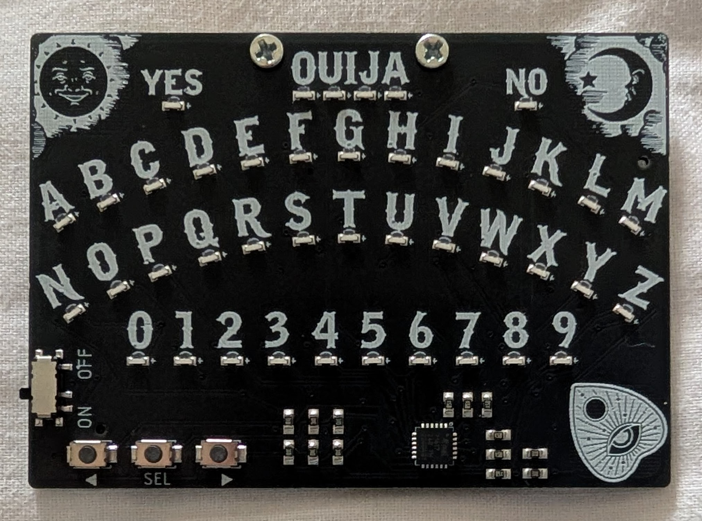
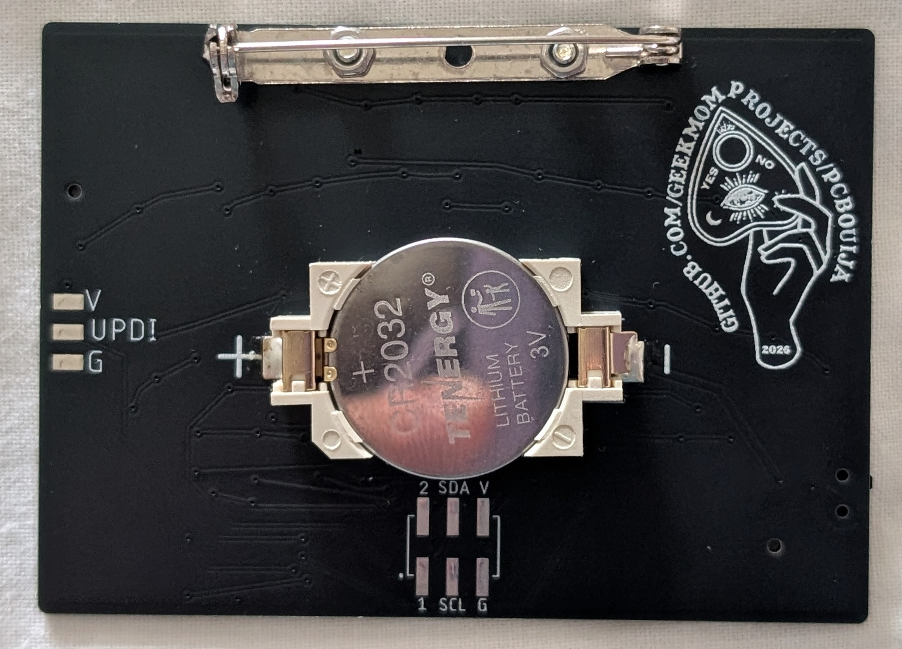

# PCBOuija

### Front

  
### Rear

 

## Features:

| PCBOuija |
| -------- | 
| Power with 3.3V - 5.0 V | 
| ATtiny1617 Processor| 
| Three push buttons, "<", "SEL", and ">" |
| SAO connectors I2C have 10K pullup resistors |
| GPIO1/GPIO2 both connected to push buttons TBD |
| Multiplexed LEDs (7 rows, 6 cols) connected directly to ATtiny pins |

There are several different modes:
-  DISPLAY mode (default): 
    - A stored text string is displayed one letter at a time and the "SAOuija" LEDs light up briefly between iterations through the string. 
    - SAOuija automatically starts in DISPLAY mode.
    - When in DISPLAY mode, a long press on the "MODE" button triggers ENTRY mode.

-  ENTRY mode:
    - When in ENTRY MODE, one character (letter or number) is highlighted (selected) at a time, and the "SAOuija" LEDs display a "scanner" animation pattern.
    - When ENTRY mode first starts, a new text string may be formed by selecting a sequence of characters (letters & numbers) using the steps below.
    - Advance through highlighted letters/numbers on the board with *short* presses of the "SELECT" button. 
    - A long (> 600 ms) press of the "SELECT" button, adds the currently highlighted character to the new text string. You may add the same letter to the string by two long presses of "SELECT" in a row, without a short press in between.
    - When in ENTRY mode, a *short* press of the "MODE" button turns off the LED on the currently illuminated character. A *long* press of the "SELECT" button while the character LED indicator is turned off adds a space character to the text string, and then re-enables character selection. Otherwise, a *short* press of either "SELECT" or "MODE" while the character LED indicator is off returns directly to character selection mode, and illuminates the current character.  
    - Anytime a new character is added to the text string being formed, the "scanner" animation stops briefly and all four "SAOuija" LEDs light up.
    - When in ENTRY mode, a *long* (> 600 ms) press on the "MODE" button triggers "ACCEPT" mode.
    - 
- ACCEPT mode:
    - In "ACCEPT" mode, either the "YES" or "NO" button will be illuminated at one time
    - Toggle between "YES" and "NO" using *short* presses of the select button
    - To keep the newly specified text once it is completely enterd, hold the "SELECT" button for a *long* press when "YES" is highlighted.
        - The newly specified text will be stored in the boards EEPROM
        - SAOuija will return to DISPLAY mode and show the new text message
    - To discard the newly specified text and return to displaying the previous text, you can:
        - Hold the "SELECT" button for a *long* press while "NO" is highlighted -or-
        - Hold the "MODE" button for a *long* press (the highlighted word doesn't matter)
     
- TOUCH MODE:
  - Touch mode is triggered by pressing the placket touch pad
 
- DECIDE MODE:
  - Decide mode will settle on a yes/no answer to any question asked, and is triggered by simultaneously touching, then releasing the sun and moon capacitive touch pads
